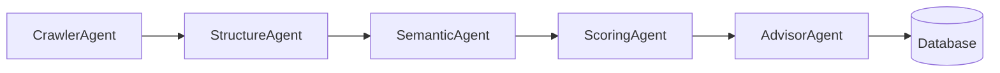

# 🧠 LEO Core — Agents Specification (v0.2)

> Part of the **LEO Labs Open-Source Project**  
> Purpose: Define the modular LangGraph pipeline used to compute **AI Visibility Scores** for websites.

---

## ⚙️ Overview

**LEO Core** analyzes how easily Large Language Models (LLMs) can interpret and retrieve information from a website.

The system uses a **LangGraph agent pipeline** that processes input URLs, evaluates their structural and semantic clarity, computes a composite **LeoRank**, and generates AI-driven improvement suggestions.

### 🧩 Pipeline Diagram



### 🧮 Scoring Formula

```
LeoRank = 100 * (0.4 * structure + 0.4 * semantic + 0.2 * retrieval)
```

---

## 🧱 Shared State (`LeoState`)

Each agent passes and mutates the shared `LeoState` object.

| Field | Type | Description |
|--------|------|-------------|
| `url` | `str` | Website URL being analyzed |
| `html` | `str` | Raw HTML fetched by the crawler |
| `text` | `str` | Cleaned readable text |
| `metrics` | `dict[str,float]` | Structural and semantic metrics |
| `leo_rank` | `float` | Final visibility score |
| `suggestions` | `list[str]` | AI-generated recommendations |

---

## 🕸️ 1. CrawlerAgent

**Purpose:**  
Fetches and parses the target website’s HTML.

**Logic:**
- Uses `requests` with headers & timeouts.
- Parses HTML via `BeautifulSoup`.
- Removes scripts, styles, and comments.
- Extracts readable text using heuristic filters.

**Outputs:**  
`state.html`, `state.text` populated.

**Metrics Affected:**  
None directly.

---

## 🧱 2. StructureAgent

**Purpose:**  
Evaluate the HTML structure for clarity and metadata richness.

**Logic:**
- Counts `<meta>`, `<title>`, `<h1-h3>`, and `<schema.org>` tags.
- Checks for OpenGraph and Twitter card tags.
- Computes normalized score:
  ```
  structure_score = (meta_tags + og_tags + schema_tags) / normalization_factor
  ```

**Outputs:**  
`state.metrics["structure"]`

---

## 🧠 3. SemanticAgent

**Purpose:**  
Quantify semantic coherence and content accessibility for LLMs.

**Logic:**
- Splits text into paragraphs.
- Uses `openai.embeddings.create` to generate embeddings.
- Computes cosine similarity between consecutive embeddings.
- Produces `semantic_score = average_similarity`.

**LLM Calls:**  
Embeddings API (1 per 2–5 paragraphs, batched).

**Outputs:**  
`state.metrics["semantic"]`

---

## 🔢 4. ScoringAgent

**Purpose:**  
Aggregate metrics and compute the final LeoRank.

**Logic:**
- Retrieves weights from `/leo/config/weights.yml`
- Applies formula:
  ```
  leo_rank = 100 * (0.4 * structure + 0.4 * semantic + 0.2 * retrieval)
  ```
- Saves result in DB via `save_score(url, leo_rank)`.

**Outputs:**  
`state.leo_rank`

---

## 💬 5. AdvisorAgent

**Purpose:**  
Provide optimization suggestions to improve LLM visibility.

**Logic:**
- If `OPENAI_API_KEY` available:
  - Calls GPT-4-mini with a concise prompt summarizing the site’s content and metrics.
  - Asks for actionable improvement steps.
- Else:
  - Generates static heuristic suggestions (e.g., “Add schema.org metadata”).
- Appends output to `state.suggestions`.

**Outputs:**  
`state.suggestions` list populated.

---

## 🗃️ Database Layer (Integration Agent)

**Purpose:**  
Persist results and enable analytics.

**Implementation:**  
SQLite by default, optional Postgres via Helm.

| Function | Description |
|-----------|--------------|
| `init_db()` | Creates tables if missing |
| `save_score(url, rank)` | Persists the score and timestamp |
| `get_recent_scores(limit)` | Fetches latest results |

---

## 🌐 MCP Server (Model Context Protocol)

**Purpose:**  
Expose LEO Core as a **GPT-native toolset** for external LLMs and agents.

**Endpoints:**
- `/tools/leo_audit?url=` — runs audit and returns report.
- `/tools/leo_recent` — retrieves recent scores.

**Manifest (`leo/mcp/config/manifest.json`):**
```json
{
  "schema_version": "1.0",
  "name": "leo-mcp",
  "description": "Run Leo audits and retrieve AI visibility insights.",
  "tools": {
    "leo_audit": {"input_schema": {"url": "string"}},
    "leo_recent": {"input_schema": {}}
  }
}
```

---

## ☸️ Deployment Agents

**Helm Components:**
- `deployment.yaml` — FastAPI service  
- `mcp-deployment.yaml` — MCP microservice  
- `cronjob.yaml` — nightly re-audit task  
- `secret.yaml` — injects `OPENAI_API_KEY`  
- `postgres-dependency.yaml` — optional Postgres subchart  

**Homebrew Components:**
- `brew/leo-core.rb` — installation formula  
- `brew/postinstall.sh` — stores OpenAI API key  

---

## 🔍 Testing and Validation

- `tests/test_pipeline.py` — verifies pipeline from crawl to rank.  
- `tests/test_api.py` — validates API endpoints.  
- `tests/test_agents.py` — ensures each agent modifies `LeoState` correctly.

---

## 🧭 Future Extensions

| Planned | Description |
|----------|-------------|
| **Kafka Integration** | Stream audit logs to external analytics pipeline |
| **Rynions AI Agents** | Persona-based analysis advisors |
| **Dashboard UI** | Visual scoring leaderboard |
| **OpenSearch Export** | Searchable visibility dataset |

---

## 🧾 Version
**v0.2.0**  
Includes:  
- Full LangGraph agent logic  
- Database layer  
- MCP server integration  
- Helm + Brew deploy support  
- Auto-documentation (this file)

---

## 📜 License
Licensed under **MIT License** — open-source and free to modify for academic or commercial use.

---

### ✅ Maintainer Note
This `Agents.md` must remain synchronized with code versions.  
When adding or modifying agents, update this file to describe new logic and LLM interactions before merging into `main`.
