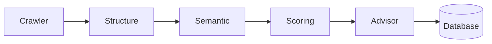

# Leo Core Architecture

The crawler ingests HTML which flows through structure, semantic, and scoring agents before the advisor produces recommendations and stores results in the configured database. The CLI, API, MCP server, and Helm deployments orchestrate this LangGraph pipeline for different surfaces.
